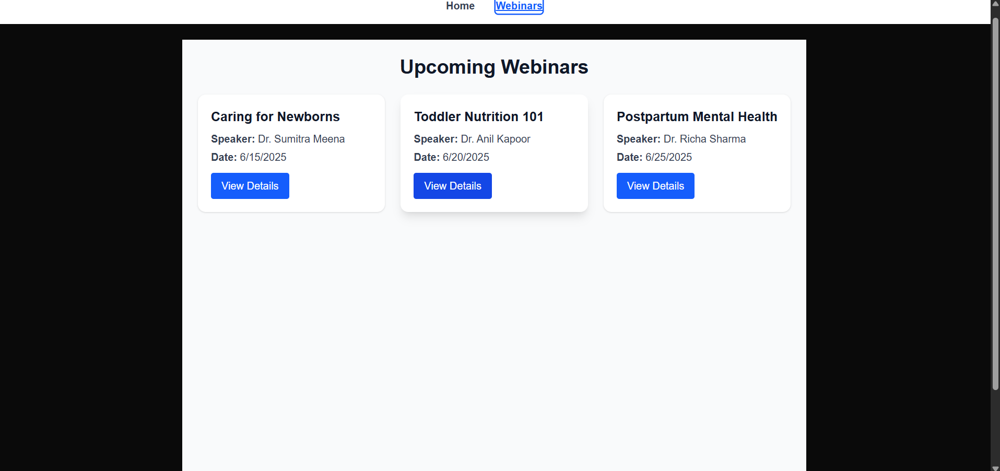

# Babynama Webinars Feature

## Live URL
https://your-project-name.vercel.app

## Choices Made
I created a simple webinars page using Next.js App Router with mock data directly in the component. I added client-side interactivity by logging webinar IDs on button clicks to keep the UI lightweight and straightforward.

## Roadblock & Learning
I ran into an issue using `usePathname` in a server component. I solved it by marking my layout as a client component with `'use client'` and restructuring the navigation accordingly.

## Screenshot

